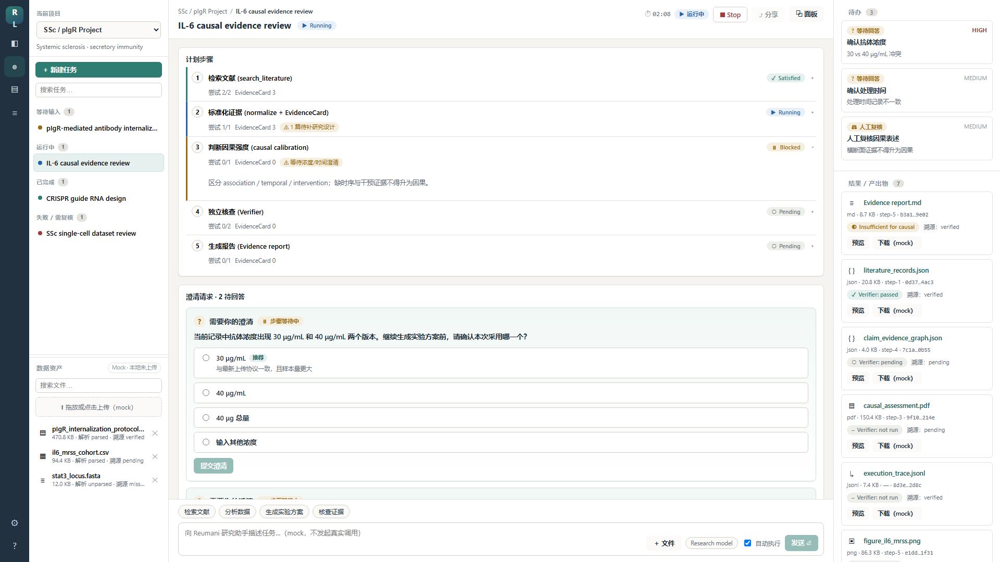
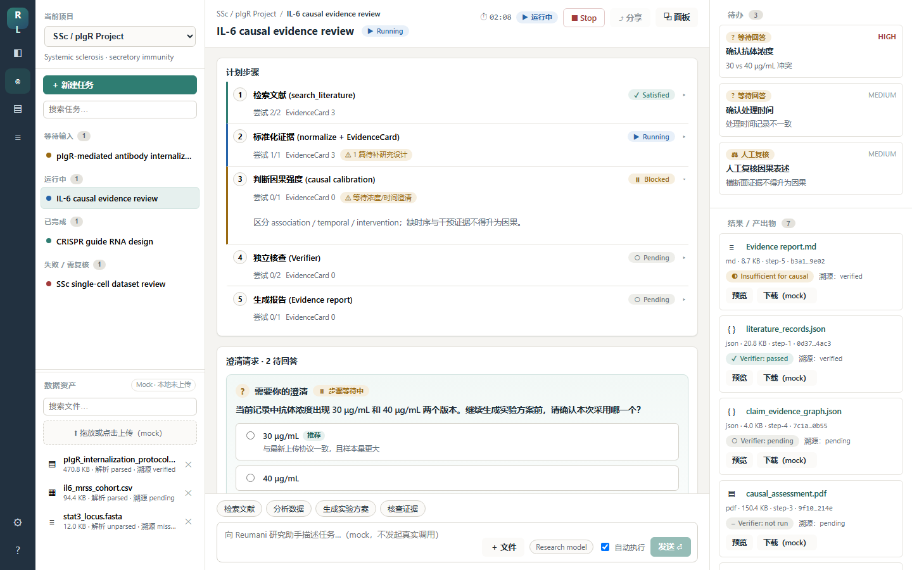
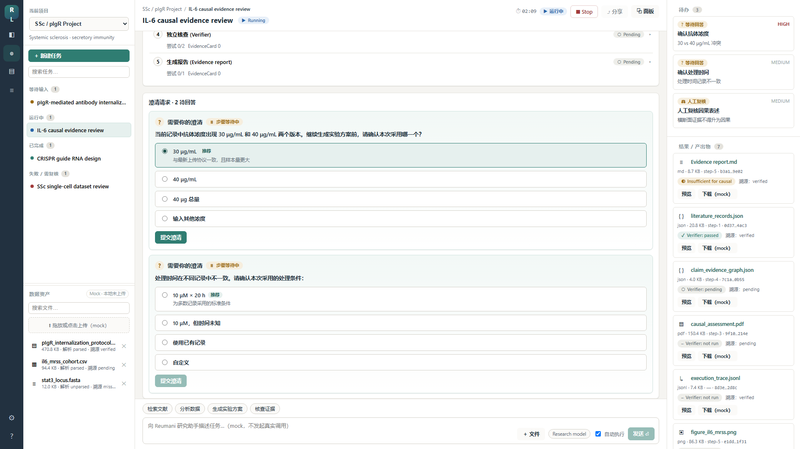
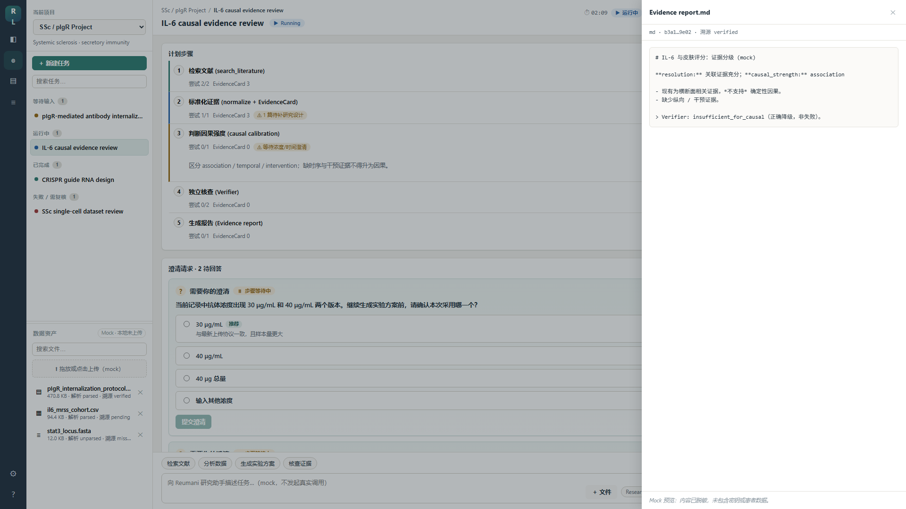

# Reumani Lab — Interactive Mock Workspace (UI-0)

**Reumani Lab** · *Rheumatology Research Workspace*

A **front-end mock prototype** of the Reumani research workspace. It reproduces the
*project → file → task → clarification → execution → artifact* interaction paradigm on
**mock data only**. It is **not** connected to any real Agent, LLM, or biomedical data
source, and issues **no network requests**.

> This is a UI/interaction prototype, not research-execution feature work. The Python
> research backend is untouched by this directory.

## Boundaries (what this is NOT)

- ❌ No real Agent / LLM / paid API calls — everything is local mock state.
- ❌ No biomedical external sources; all previews are desensitized placeholders.
- ❌ Does not read the Python `.env`, protocol, evals, or any backend code.
- ✅ Uploaded files stay **in the browser only** (localStorage) — nothing is sent anywhere.
- ✅ Status is always shown with a **glyph + label**, never by color alone (accessibility).

## Status & roadmap

- **This is a mock prototype.** It is **not yet connected to a real Agent.**
- Next phase is **A.7.4.3 EvidenceAccumulator** (backend), then the Step Controller.
- **UI-1** will wire this workspace to real events: the mock store
  (`src/store/LabStore.tsx`) is replaced by an **API / SSE** client while the
  presentational components (all consuming `useLab()`) stay unchanged.

## Screenshots

Captured from the running dev server against mock data only (no real research data,
no keys, no patient data, no absolute paths). Source: `docs/screenshots/`.

| View | Image |
| --- | --- |
| Main workbench — 1920×1080 |  |
| Main workbench — 1440×900 |  |
| Clarification card expanded |  |
| Artifact preview drawer |  |

## Stack

- React 19 + TypeScript + Vite 8
- Plain CSS design tokens (`src/theme.css`) — independent brand, no CSS framework
- State via React Context + `useReducer` with a `localStorage` persistence layer
- Tests: Vitest + Testing Library + jsdom

The front-end toolchain is fully isolated from the Python / numpy environment
(everything lives under `reumani_lab_ui/node_modules`).

## Install & run

```bash
cd reumani_lab_ui
npm install
npm run dev        # start the dev server (http://localhost:5173 by default)
```

Other scripts:

```bash
npm run typecheck  # tsc -b --noEmit
npm run build      # tsc -b && vite build
npm run test       # vitest run (20 interaction tests)
npm run lint       # oxlint
```

## Layout

A four-zone desktop workbench:

| Zone | Content |
| --- | --- |
| Left rail | Navigation (projects / work center / data / protocols / settings / help) |
| Left sidebar | Project switch, task groups (等待输入 / 运行中 / 已完成 / 失败需复核), file assets |
| Center | Task header + runtime control, plan steps, clarification cards, timeline + trace |
| Right | Todos (top) and results / artifacts (bottom) |
| Bottom | Composer (multiline input, quick actions, model placeholder, auto-execute toggle) |

## Core interaction — clarification

The clarification card (`src/components/ClarificationCard.tsx`) is fully operable:
select an option (a recommended, non-forced default is marked), or choose *Other* and
type a value. Submit is disabled until a valid choice is made. On submit the card flips
to **Clarification answered**, a `clarification_answered` event is appended to the
timeline, the matching todo is removed (count decreases), and once **all** clarifications
on a step are answered that step moves `blocked → running`. All of this is front-end mock
state, optionally persisted to `localStorage`.

## Mock data & the service boundary

Mock data lives in `src/mocks/` (`projects.ts`, `files.ts`, `tasks.ts`, `artifacts.ts`)
and flows through a single store (`src/store/LabStore.tsx`). Components never hard-code the
data set — they read/write through `useLab()`. This is the seam for a later real backend.

### Swapping the mock for a real API / SSE

1. Replace the `seed()` initial state in `LabStore.tsx` with data fetched from the API.
2. Replace the mutating reducer actions (`answer_clarification`, `send_message`,
   `runtime_*`) with calls that POST to the backend and apply the server's response.
3. Subscribe to a server-sent-events / websocket stream and dispatch incoming
   `TimelineEvent`s (the `TimelineEventType` union already mirrors the backend event types).
4. Swap the mock Blob download in `ArtifactPanel.tsx` for a real artifact fetch.

Because every component consumes `useLab()` and the typed contracts in `src/types.ts`,
none of the presentational components need to change.

## Tests

`src/__tests__/app.test.tsx` covers 20 interaction items: render, project/task switch,
mock file upload, delete-with-confirm, file search, clarification submit-gating and the
full answer flow (timeline update, todo decrement, step unblock), trace toggle, artifact
preview, mock (Blob) download, runtime clock, stop, resume, composer send, **assertions
that no `fetch`/XHR is issued**, and namespaced localStorage persistence.
